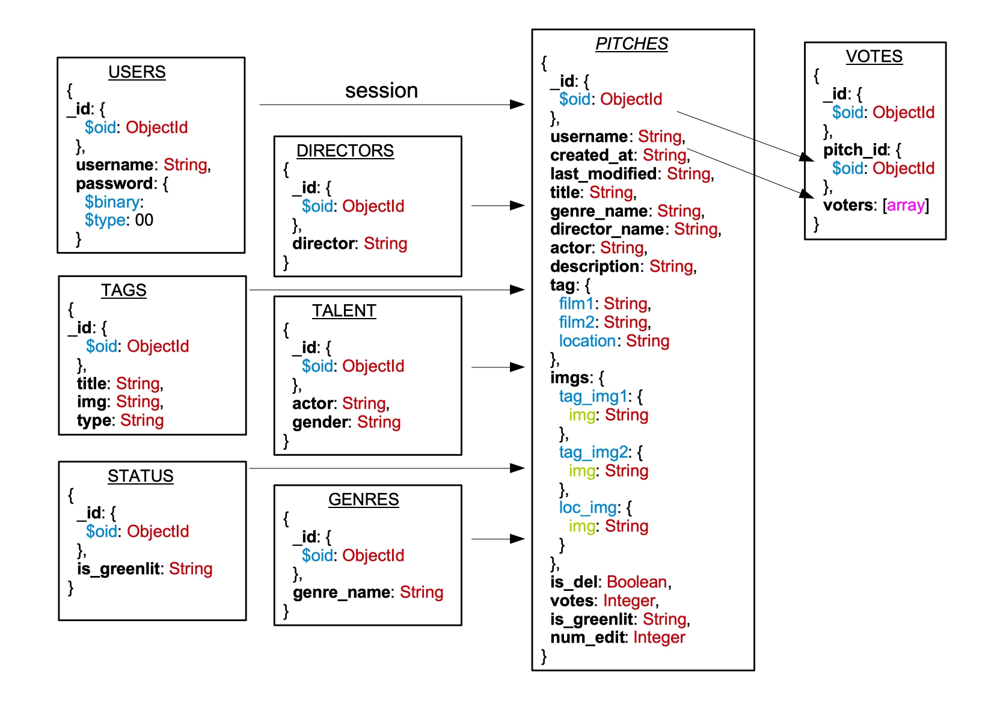

# DATA CENTRIC DEVELOPMENT MILESTONE PROJECT

## GREENLIT

## Project Overview

The project presented [here](https://greenlit-flaskapp.herokuapp.com/) is an imagined services for a film production house. It's only a matter of time before AI and machine learing technology is applied to the film industry, in fact it has [already happened](https://en.wikipedia.org/wiki/Sunspring).

This project is a prototype for how one might take thid to its next logical step, a production company that uses machine learning to assess the likelihood of a films success in the real world before any of the real work is done.

Users of this site can add a movie idea, formatted around the idea of a [two minute elevator pitch](https://www.lightsfilmschool.com/blog/what-is-the-two-minute-elevator-pitch#). 

Once they add a pitch they can submit it for processing by the companies machine learning algorithm would scrape the internet based on the content provided and evaluate based on certain criteria (whats worked before etc.) the likely success of the film id it was to be made.

Now, I've obviously not built this. I've built the site around which this imagined service might be presented. In this itteration, when the submit button is selected, the status of the pitch is randomly selected i.e theres a 50% chance of it going either way.
I have added some [Easter Eggs](https://en.wikipedia.org/wiki/Easter_egg_(media)) as proof of concept. For example a movie with David O Russel as the director and Christain Bale as the actor will not get greenlit given they a massive fall out while making American Hussel. Also, any pitch with Matt Damon will always fail unless it has more then five votes.

The goals of this project are to:

Develop general Python skills.
Write some vanilla python.
Learn how to work in Flask.
As I have a lot of previous experience with relational DB systems I choose to learn MongoDB on this project.
To get an understanding of how to use session variables.
To get experience working in with environments (here I used pipenv).
To get some experience of deployment to Heroku.
To make a site with a level of complexity I've not attempted before, and to make it a plesent experience for a user.

## NOTE
**Some features (delete users, flush pitches, view stat charts) are only available to the admin user. To view log in as 'admin' with the password 'admin'**

### User Stories

Three types of users:
 - Non registered browser
 - Registered user
 - Admin

##### As a non registered user
 - I want to quickly get a understanding of the site.
 - I want to be able to view examples of _pitches_
 - I want to have a content filter
 - I want to be able to register and partake 

 ##### As a registered user (member)
  - I want to to log in and see my pitches
  - I want to add new pitch ideas
  - I want to edit current ideas
  - I want to sort my pitches by votes
  - I want to filter my own pitches by greenlit status
  - I want to see and filter other peoples pitches
  - I want to vote on other peoples pitches
  - I want to be able to remove that vote
  - I want to submit my pitch
  - I want to remove pitches
  - I want friendly messaging as to what my options are at each stage
  - I want to be able to log out
  - I don't what users who are not me to have write access on my pitches
  - I don't want users to be able to vote for other pitches multiple times
  - I don't want other users to be able to vote for their own pitches

 ##### As a admin user 
  - I want to delete users
  - I want to view and filter all pitches
  - I want to see stat charts on users and user data
  - I want my part of the site to be secure from other users

### Data Model

#### Directors, Genres, Tags and Talent
These four collections contain the users options when adding or editing a pitch. Initiallty I had stored them in a single collection but eventually decided that if I was to scale up the site they should be seperate. For example the Actors and Directors collections could be built up with data used to populate talent profile pages.
The Tags and Genres collection could have write access allowed. For this project I decided not to allow users add their own.

#### Users
A document is inserted on a user registering.

#### Status
This is small collection used for the filter by status function

#### Pitches
Pitches collection documents are inserted on adding a pitch and updated on editing a pitch, voting for a pitch, submitting a pitch and removing a pitch. They contain all the data displayed in the pitch drop downs.
On insert, tag storyboard data (tag_img1 etc) is automatically inserted to choose the corresponding images from the [images directory](static/images/).

#### Votes
On clicking the vote button, If a pitch is not already in the votes collection, a new document with the pitches _id and an array is added to this collection, the current user's username will be the first item in the array. The vote field of the pitch
in the pitches collection is incremented by 1.
If the pitch's _id is in the votes collection and the current user is in the array,
that voter's name is pulled from the array and the vote field of the pitch
in the pitches collection is deincremented by 1.
Otherwise, if the pitch's _id is in the votes collection and 
the current user is NOT in the array, I push the current user to the array and
increment the vote field of the pitch in the pitches collection by 1.

### UX
#### Wireframes

[Here](static/assets/wireframes/)

#### Typography

Default system fonts are used for the bulk of text.
The text in the pitch dropdown is courier as is the style for screenplays and scripts.

### Features

##### Login/Register/logout

Users can register, log in and log out. For each state of user there is some custom content and messaging.

##### Navbar

The navbar builds on the process outlined [here](https://jinja.palletsprojects.com/en/2.10.x/tricks/). 
Active pages are highlighted and each state of user get custom navigation options.

##### View

A non logged in user can view all pitches.
A logged in user can view all other pitches at one end point and just their own at another.
Pitches are presented in a custom jQuery dropdown.

##### Filter / Sort

Users can filter their own pitches by their greenlit status.
Users can filter all pitches by genre.
Users can sort pitches by votes.

I had initally created multiple routes to achieve this. This way allowed me to add multiple filters to a single page, each filter would load a new page. On speaking to my mentor it was suggested that this is not the standard approach, that I should use query parameters. In doing so I was not able to replicate the multiple filters without altering the style of my dropdowns to include a submit button. I'm sure given some more time and effort I could get it to work. For now it is what it is, I'm glad I made the change and learned something about how to use query parameters. Though it means that a users filter is cleared when they tru to sort.

##### Add

Users can add new pitches. They have to choose at least a Title and a Genre. The validation for this is handled server side by Python.

As a play on the two minute pitch idea, descritions can be a max of 399 characters.

Users can choose from some classic movies and locations to build a tagline.
Depending on what the choose, an image storyboard is automatically created.
If they do not choose from one of the options, default text is inserted along with a random picture of an animal.

##### Edit

Users have three edits for each pitch. On update the num_edit field is incremenetd by 1. The button in the html is deactived and a tooltip message displayed informing the user that they have reached max number of edits. The submit button also deactivates. It then reactives if that pitch gets more then 5 votes.

At the time of submission I was not able to find a multiline text input where the current values are retined and directly editable.
textareas do not allow this, you can have the data there but it will dissappear as soon as its activated by the cursor. The basic inputs used cannot be multiline but do allow direct editing of current values. As a result the inputs for editing are a bit too small and impractical.

##### Vote

Users can vote for other users pitches not there own.
They can up vote and remove their vote.

##### Submit

Users can submit if they have less than 3 edits made or if they have more than 5 votes.
Conveniently, in order for this to be tested I have a pitch with 3 edits and 4 votes ready. To test:
- log in as user: mary, password: mary
- look for the pitch titled: 'Mary The Return' 
- it has no edits left, the submit button is deactivated and it has four votes
- log out and in as your own user
- vote for 'Mary The Return' 
- log back in as mary and the submit button should be activated 

In the time I had I was not able to make it so a user would have one submit on initially creating a pitch and would then have to make a edit before being able to resubmit. This will need to left to the next phase of development.

##### Remove / Delete

User can remove their Pitch. As far as they know this totally removes it but it actually just updates a boolean so it is not rendered. 
The admin user van completely delete all removed edits.

##### Content / Messaging

Flash messaging is used to relay information to the user

##### Admin

The admin user can:
1. delete users
2. flush all removed pitches
3. View some charts

###### Charts

D3, DC and crossfilter have been used to render live charts from the data in MongoDB.

I followed the blog post [here](http://adilmoujahid.com/posts/2015/01/interactive-data-visualization-d3-dc-python-mongodb/) to achive this.

The get_data route finds all the pitches data and appends to an array. The data in the array is then dumped to json and made available at the get_data/ end point to D3 to access and render.

I have added some basic charts as proof of concept but there is a lot of scope for further developement when the dataset itself grows.

#### Left to Implement

- Talent Profiles
- Blocking submit until a new edit is made
- More Charting
- Better User data
    - user own stats page / profile
- UX
    - flash message styling
    - better typography
    - Pagination
- Multiple Query Parameters for filter and sort
- Code refactoring 
- Flask login instead of session login

## Testing

There is no automated testing.

Manual Testing through development of the site consisted of asking the following questions each time a significnat feature was added, removed or changed. 

What happens:

	- if no pitches exist in collection?
		- for non logged in
		- for logged in
			- in own ps
			- in all ps
		- for admin	
	- if user does not use correct case on text input?
		- in edit
		- in view
    - if user maually enters url endpoints?
        - non logged in 
        - logged in
        - admin
        - do the messaging/redirects make sense, can they get home and start again?
    - if a pitch is removed (is_del == True)
        - to any app function which requires a count of documents?
    - when viewed, if user does not select from options on add/edit
        - to text
        - to storyboard
    - when users click links, are they ever confused about where they are, do they have further options, can they always get home
        - logged in
        - not logged in
        - admin
        - after initial register
        - after logging out
    - when user enter incorrect username/password
    - when a user is newly registered
        - is the messaging correct
        - can they easily add a pitch
        - are their options re edits clear
        - does the edit function work
        - does the submit function work
    - at all times
        - are the dropdown options working?

The site deployed to Heroku was also periodically tested asking the above questions.

##### Users

The site was tested to see if each of the user stories outlined above were met.
In order to assess the sites usability I have shared it for testing with some fiends and collegues and resonded to feedback where possible.

##### Responsiveness

The site as vigorously tested in Chrome Developer Tools in responsive mode and at all screen sizes on a variety of device brands. This involved selecting _inspect_ and the _toggle device toolbar_ options. Then selecting through common devices (Galaxy S5, Google Pixel devices, iPhones of various sizes, iPad, iPad Pro) in order to see if my Bootstrap Grid set up allowed the text and charts to flow and flex without any visual or technical issues.
The site was also physically tested on a Samsung Galaxy Tab, an iPhone 6, a Windows Desktop machine and a Retina Screen MacBook Pro.

##### Browsers
The site was tested in Chrome, FireFox, Safari and Opera.
 

### Validation

CSS files where found to be valid via the offical W3 code validators.

CSS : https://jigsaw.w3.org/css-validator/

HTML has not been validated or commented as html as neither will work in a Jinja template

JavaScript files were tested at : https://jshint.com/

Python was checked for Pep* compliance at : http://pep8online.com/

## Deployment

I used a 'walking the skelethon' approach, deploying early to Heroku.

The site is deployed to Heroku under the following process:

1. Create a local git respositry in your project
2. Push to Github
3. In Heroku, under Deploy - Deployment Method: Connect to GitHub
4. Follow guidlines to connect the app to the GitHub repo
5. Allow automatic deploys
6. Under setting - Reveal Config Vars
    - set the port to 0.0.0.0 - this opens your app to all IPS
    - set the port to what you want
    - debug to false
    - set the relevant MONGO URI
7. When code is pushed to GitHub it is automatically depolyed to the Heroku app
8. Once the project is built, launch the app and test

### How to clone locally

The site can be cloned from GitHub and ran locally by following the following steps:

- Go to my [repo](https://github.com/select-8/greenlit-flask-mongodb)
- Click the Clone or Download option
- Copy tyhe Url
- In your local environment, wherever you want to store the code do: 
    - git clone < the copied url >
- The repo will be downloaded
- cd into it in terminal
- Create yourself a virtual environment, I used pipenv
    - sudo pip3 install pipenv.
- To start the shell environment, do:
    - pipenv shell 
- Install project requirments using the requirments.txt file
    - pipenv install -r requirements.txt
- Create a .flaskenv file
    - touch .flaskenv
    - nano .flaskenv
        - FLASK_ENV=development
    - ctrl-X to prompt exit
    - y to save edit
- You can now run the project by doing:
    - flask run
    - open the app at http://127.0.0.1:5000/

However, you will not have access to the data. To got this you will need to create your own mongo instance and upload the dump files located [here](static/assets/greenlit) 
To do this you can used the mongoimport command:
            
    mongoimport --db <dbname> --collection <collection_name>
        --authenticationDatabase admin --username <user> --password <password> 
        --drop --file ~\path\to\files.json

Then set the MONGO_URI environment variable in a .env file

You should now be able to register and start adding pitches!

## Technologies Used

##### LANGUAGES
- [HTML](https://www.w3.org/html/)
- [CSS](https://www.w3.org/Style/CSS/Overview.en.html)
- [JavaScript](https://www.javascript.com/)
- SQL
- [Python](https://www.python.org/)

##### VERSION CONTROL
- [GIT](https://git-scm.com/)

##### Deployment
- [HEROKU](heroku.com)

##### Environment
- [pipenv](https://github.com/pypa/pipenv)

Create virtual python environments.

Use pipenv install ... to install project requirments 

A .flaskenv file with FLASK_ENV=development means your always in debug mode

##### FRAMEWORKS

- [Flask](https://palletsprojects.com/p/flask/)

    - Used to build the web application
    - Imports
        - session - to manage user sessions
        - flash - to display messages on user actions
        - render_template, redirect, url_for - used to navigate user to the correct end points
        - request - for query parameters
        - flask_pymongo - flask binding for mongodb
        - bcrypt - password encryption 
        - datetime - to parse time

- [Jinja](https://jinja.palletsprojects.com/en/2.10.x/templates/)

Templating engine used with flask to render html

- [Bootstrap](https://getbootstrap.com/)

To create a responsive grid

- [jQuery](https://jquery.com/)

To create the dropdown effect for pitches and do do tooltips

- [D3](https://d3js.org/)

To render the charts in the DOM as SVG

- [dc.js](https://dc-js.github.io/dc.js/)

Provided templates for the charts
- [crossfilter.js](https://square.github.io/crossfilter/)

Provides multidimentional filtering of data in dc charts

- [queue.js](https://github.com/d3/d3-queue)

Evaluates asynchronous tasks to handle callbacks

##### APIs
 - [Google Fonts](https://fonts.google.com/)

##### SOFTWARE AND SERVICES
- [Visual Studio Code](https://code.visualstudio.com/)
- [GitHub](https://github.com/)

##### Database
- [MongoDB](https://www.mongodb.com)

##### EDITORS
- SUBLIME
- ATOM

##### VMWARE
- UBUNTU V18.04

##### HARDWARE
- MAC OSX

##### PROJECT MGMT
- SLACK
- NOTION

## Credits

The flask and Jinja and mongodb documentation was used heavily.

The code to remove NULL rows from the results of a crossfilter was found [here](https://github.com/dc-js/dc.js/wiki/FAQ#remove-empty-bins)

